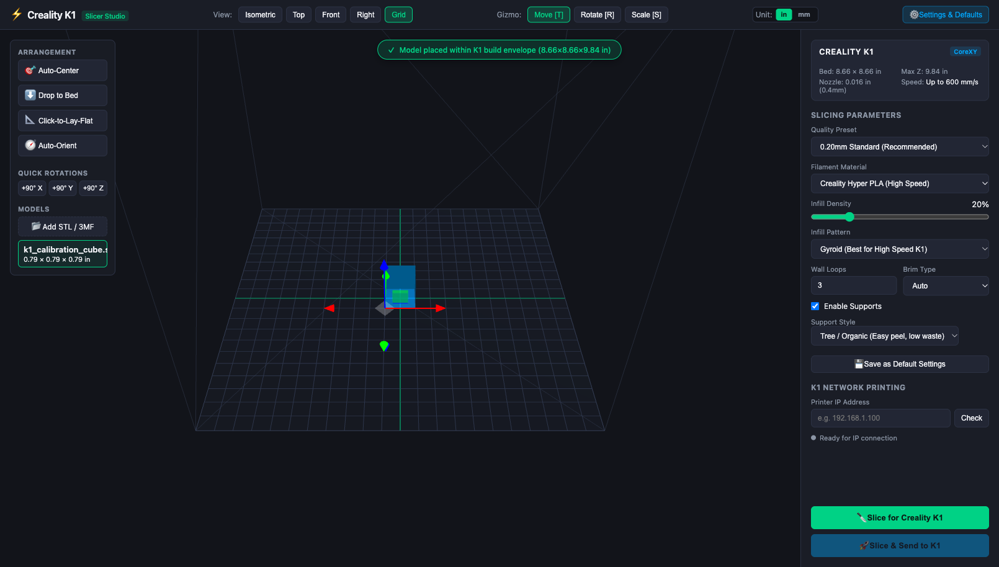
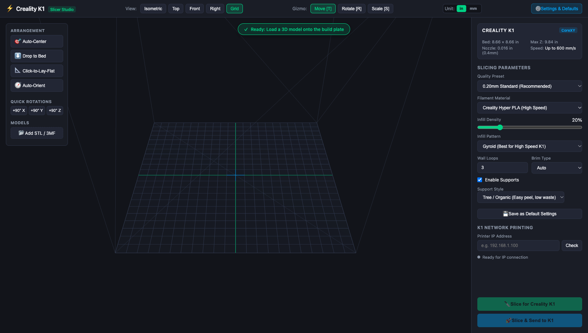
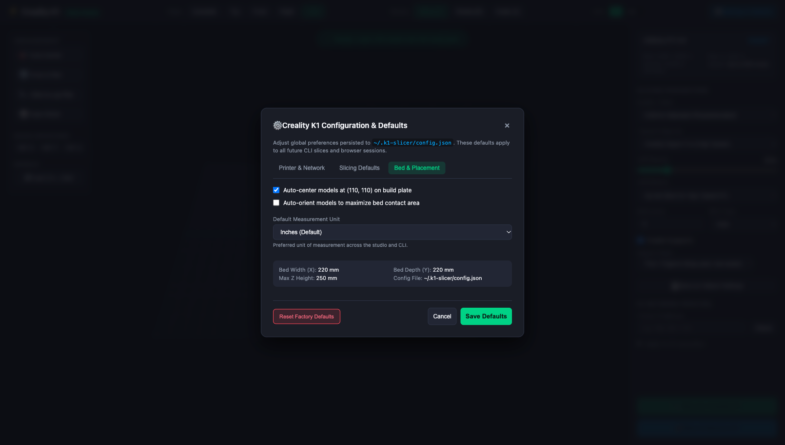

# Creality K1 Slicer Util ⚡

A high-performance, developer-grade CLI and interactive 3D Plate Studio for the **Creality K1** 3D printer.

Built to eliminate the bloat, slow startup, and telemetry/spyware concerns of vendor GUI slicers while providing 100% slicing parity with Creality Print v5 using the audited, open-source **OrcaSlicer Core** engine.



> 📘 **New to K1 Slicer Util?** Check out the step-by-step **[Complete Tutorial & Guide (TUTORIAL.md)](TUTORIAL.md)**.

---

## Features

- ⚡ **Instant Headless Slicing:** Slice directly from your terminal in under 1 second (`k1-slice model.stl`).
- 🎯 **Smart Geometry Engine:**
  - Automatic centering at $(110, 110)$ on the $220 \times 220\text{ mm}$ K1 build bed.
  - Automatic grounding to $Z = 0$.
  - Real-time boundary validation (warns if model penetrates bed, floats unsupported, or exceeds $220 \times 220 \times 250\text{ mm}$).
- 🧭 **Heuristic Auto-Orient:** Analyzes planar facets to identify optimal orientation for maximum bed adhesion and minimal support volume.
- 📐 **Interactive 3D Plate Studio (Browser):**
  - Full 360-degree freedom in all 3 axes (orbit, pan, zoom, preset views).
  - Out-of-bounds visual feedback (model turns glowing red if outside envelope).
  - **Click-to-Lay-Flat:** Click any surface on the 3D model to instantly align it flush with the build plate.
  - 3D Transform Gizmos for translation, rotation (with +90° shortcuts), and scale.
  - Drag-and-drop file loading straight from Finder/Desktop.
  - Multi-file staging on a single build plate.
- ⚙️ **Bidirectional Settings & Defaults Manager:**
  - Configure default printer IP, presets, materials, infill, supports, and placement rules.
  - Manage defaults directly via terminal commands or the in-browser **Settings & Defaults** modal.
  - Saved globally to `~/.k1-slicer/config.json` and synchronized across all sessions.
- 🎛️ **Exact Creality K1 Settings Parity:**
  - Presets: Standard (0.20mm), Fine (0.12mm), Optimal (0.16mm), Draft (0.24mm).
  - Filaments: Creality Hyper PLA (up to 600 mm/s), Generic PLA, Hyper PETG, Hyper ABS, Generic TPU 95A.
  - Infill controls (Gyroid, Grid, Cubic, Honeycomb, Lightning).
  - Support structures (Tree / Organic vs Normal / Grid).
  - Wall loops, perimeters, and brim adhesion.
- 📡 **Direct Network Printing:**
  - Upload directly to Creality K1 over LAN via Moonraker (port `7125`) or stock Creality OS Web API (port `80`).
  - Optional `--print` flag to fire-and-forget start the job immediately.

---

## Installation & Quickstart

### Option 1: Automated 1-Click Setup (Recommended)
Clone the repository and run the automated setup script. It automatically detects your OS, checks for OrcaSlicer (offering to install it via Homebrew on macOS), installs npm dependencies, builds the binaries, links `k1-slice` globally, and executes a verification test:

```bash
git clone git@github.com:PopBot/creality-slicer-util.git
cd creality-slicer-util

# Run the automated setup wizard:
./scripts/setup.sh
# (or: npm run setup)
```

---

### Option 2: Manual Installation

#### 1. Prerequisites
- **Node.js (v18+)**: [Download Node.js](https://nodejs.org/) or install via Homebrew: `brew install node`
- **OrcaSlicer Core**: The underlying slicer engine.
  - **macOS (Homebrew):**
    ```bash
    brew install --cask orcaslicer
    ```
  - **macOS / Linux / Windows Manual:** Download the latest release from [OrcaSlicer GitHub Releases](https://github.com/SoftFever/OrcaSlicer/releases) and place the application in `/Applications/OrcaSlicer.app` (macOS) or your PATH.

#### 2. Install & Build
```bash
git clone git@github.com:PopBot/creality-slicer-util.git
cd creality-slicer-util

# 1. Install dependencies
npm install

# 2. Compile TypeScript
npm run build

# 3. Link globally so you can use 'k1-slice' from any terminal
npm link

# 4. Run test suite to verify
npm test
```

---

## Workflow & Modes of Operation

### Mode 1: Standalone Application / 3D Plate Studio
To simply open the 3D Plate Studio to adjust settings, connect to your printer, or drag-and-drop models onto the bed:
```bash
# Launch directly in your browser:
k1-slice

# Or explicitly:
k1-slice studio
```



### Mode 2: Quick Headless Slicing
Slice an STL file directly from the terminal with default K1 profiles in under 1 second:
```bash
k1-slice ./my_bracket.stl
```
Output:
```text
======================================================
  ⚡ CREALITY K1 SLICER ENGINE (OrcaSlicer Core)
  Bed Volume: 220 × 220 × 250 mm | Preset: standard
======================================================

📦 Model Metrics: my_bracket.stl
   Dimensions : 45.0 × 30.0 × 18.0 mm
   Position   : X [0.0 to 45.0], Y [0.0 to 30.0], Z [0.0 to 18.0]
   Triangles  : 1,840
🎯 Auto-centering model at (110, 110) and grounding to Z=0...
🔪 Slicing with Creality K1 profiles...

✅ SLICING COMPLETE in 0.4s!
──────────────────────────────────────────────────────
  ⏱️  Est. Print Time : 24m 15s
  🧵 Filament Used   : 2.18 m (6.5 g)
  🥞 Layer Count     : 90 layers
  📏 Max Z Height    : 18.00 mm
  💾 Output G-Code   : ./my_bracket.gcode (1.20 MB)
──────────────────────────────────────────────────────
```

### Mode 3: Interactive Visual Preview & Slicing
To preview, inspect, or adjust orientation before slicing:
```bash
k1-slice ./my_bracket.stl --preview
```
*(Also automatically escalates and launches the browser if geometry issues like floating meshes or bed clipping are detected)*.

---

## Configuring Settings & Defaults

You can configure and persist default settings **both in the Browser Studio and via the CLI**. All defaults are stored in `~/.k1-slicer/config.json`.

### Option A: In the Browser (Settings Modal)
1. Open the studio: `k1-slice`
2. Click the **`⚙️ Settings & Defaults`** button in the top navigation bar.
3. The modal is organized into three tabs:
   - **Printer & Network:**
     - Set default K1 IP address (e.g. `192.168.1.150`).
     - Set Moonraker port (`7125` for rooted/Helper script, `80` for stock Creality OS).
     - Click **"Test Connection"** to verify communication and retrieve live status.
   - **Slicing Defaults:**
     - Default Quality Preset (`standard`, `optimal`, `fine`, `draft`).
     - Default Filament (`hyper-pla`, `pla`, `petg`, `abs`, `tpu`).
     - Default Infill % and Pattern (`gyroid`, `grid`, `cubic`, `honeycomb`, `lightning`).
     - Default Wall Loops count and Brim adhesion type.
     - Default Support toggle and Support Style (`tree` organic vs `normal` grid).
   - **Bed & Placement:**
     - Toggle auto-centering at $(110, 110)$ by default.
     - Toggle auto-orient heuristic by default.
4. Click **"Save Defaults"** to write changes to `~/.k1-slicer/config.json`.
5. Click **"Reset Factory Defaults"** to restore original recommended profiles.



### Option B: In the Terminal (CLI `config` command)
```bash
# 1. View all saved defaults:
k1-slice config

# 2. Set default printer IP:
k1-slice config set printer-ip 192.168.1.150

# 3. Set default material or quality preset:
k1-slice config set material hyper-pla
k1-slice config set preset standard
k1-slice config set infill 20
k1-slice config set infill-pattern gyroid
k1-slice config set walls 4
k1-slice config set support-type tree

# 4. Read back a specific default setting:
k1-slice config get printer-ip

# 5. Reset all configuration to factory defaults:
k1-slice config reset
```

---

## Slicing Overrides & Direct LAN Printing

### Custom Settings Overrides
```bash
# High detail (0.12mm), 30% gyroid infill, 4 wall loops, tree supports:
k1-slice figurine.stl -p fine --infill 30 --infill-pattern gyroid --walls 4 --supports --support-type tree

# Draft speed (0.24mm) for rapid prototyping:
k1-slice enclosure.stl -p draft -m hyper-pla --infill 15

# PETG functional part with outer brim:
k1-slice hinge.stl -m petg --brim outer --walls 4
```

### Direct LAN Printing to Creality K1
```bash
# Slice and upload to K1's Moonraker:
k1-slice gear.stl --printer-ip 192.168.1.150

# Slice, upload, AND immediately start printing:
k1-slice gear.stl --printer-ip 192.168.1.150 --print
```

---

## Command Line Options Reference

| Flag | Description | Default |
| :--- | :--- | :--- |
| `-p, --preset <preset>` | Quality preset: `standard` (0.20mm), `fine` (0.12mm), `optimal` (0.16mm), `draft` (0.24mm) | Config default (`standard`) |
| `-m, --material <mat>` | Filament: `hyper-pla`, `pla`, `petg`, `abs`, `tpu` | Config default (`hyper-pla`) |
| `--infill <percent>` | Infill density percentage (e.g. `20` for 20%) | Config default (`20`) |
| `--infill-pattern <pat>`| Pattern: `gyroid`, `grid`, `cubic`, `honeycomb`, `lightning` | Config default (`gyroid`) |
| `--layer-height <mm>` | Custom layer height in mm | Preset default |
| `--supports` | Enable support generation | Config default (`true`) |
| `--no-supports` | Explicitly disable supports | - |
| `--support-type <type>`| Support style: `tree` (organic) or `normal` (grid) | Config default (`tree`) |
| `--brim <type>` | Brim adhesion: `auto`, `outer`, `inner_and_outer`, `none` | Config default (`auto`) |
| `--walls <count>` | Number of wall loops / perimeters | Config default (`3`) |
| `-o, --output <path>` | Custom output `.gcode` destination | `<model>.gcode` |
| `-i, --preview` | Force launch 3D Plate Studio in default browser | - |
| `--auto-center` | Automatically center mesh at $(110, 110)$ and drop to $Z=0$ | Config default (`true`) |
| `--no-auto-center` | Do not auto-center the model | - |
| `--unit <unit>` | Measurement unit: `inches` or `mm` | Config default (`inches`) |
| `--printer-ip <ip>` | K1 LAN IP address (uploads via Moonraker or Creality OS) | Config default |
| `--print` | Automatically start print job after network upload | `false` |
| `--headless` | Force headless slicing even if placement warnings exist | `false` |

---

## 3D Plate Studio Controls & Units

### 📏 Inches & Millimeters Support
- **Default in Inches:** All dimensions (K1 bed size: $8.66 \times 8.66 \times 9.84\text{ in}$, model dimensions, bounding limits) default to inches.
- **Instant Toggle:** Switch between `in` and `mm` at any time with the top-bar toggle button group.
- **Configurable Persistence:** Set your preferred default unit in `k1-slice config set unit <inches|mm>` or via the Bed & Placement tab in the Settings modal.

### Keyboard & Mouse Navigation
- **Left Mouse Click + Drag:** Full 360° orbit rotation in all 3 axes.
- **Right Mouse Click + Drag:** Pan camera across the build plate.
- **Scroll Wheel:** Zoom in / out.
- **Gizmo Shortcuts:** `T` for Translate (Move), `R` for Rotate, `S` for Scale.
- **Quick Angles:** Click `+90° X`, `+90° Y`, or `+90° Z` to snap-rotate the selected model.
- **Click-to-Lay-Flat:** Click **"📐 Click-to-Lay-Flat"**, then click any planar face on your 3D mesh. The engine calculates the face normal, rotates the model flush onto the plate, and snaps $Z=0$.
- **Drag-and-Drop:** Drag `.stl` or `.3mf` files from Finder directly onto the browser canvas to load them.

---

## Architecture & Verification

```text
k1-slice (CLI)
   │
   ├─► ConfigManager (~/.k1-slicer/config.json persistence)
   ├─► STLParser (Geometry verification & auto-centering)
   ├─► AutoOrient (Planar normal vector scoring)
   ├─► 3D Plate Studio (Express + Three.js local studio on ephemeral port)
   ├─► OrcaWrapper (Spawns OrcaSlicer CLI with Creality K1 profiles)
   ├─► GcodeParser (Extracts print times, filament mass/length, layer counts)
   └─► K1PrinterClient (Moonraker port 7125 & Creality OS port 80 HTTP client)
```

Run test suite:
```bash
npm test # runs npx tsx tests/slicer.test.ts
```
All unit and end-to-end tests verify mesh dimension checks, auto-centering, out-of-bounds triggers, configuration serialization, and G-code generation with Creality K1 start macros.
