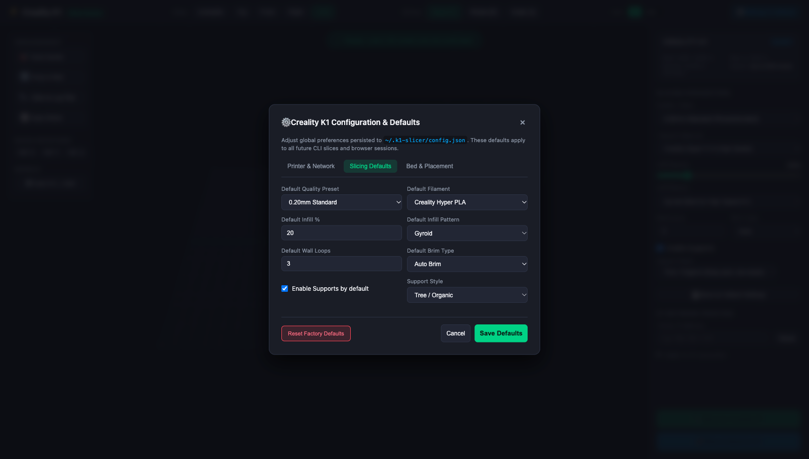
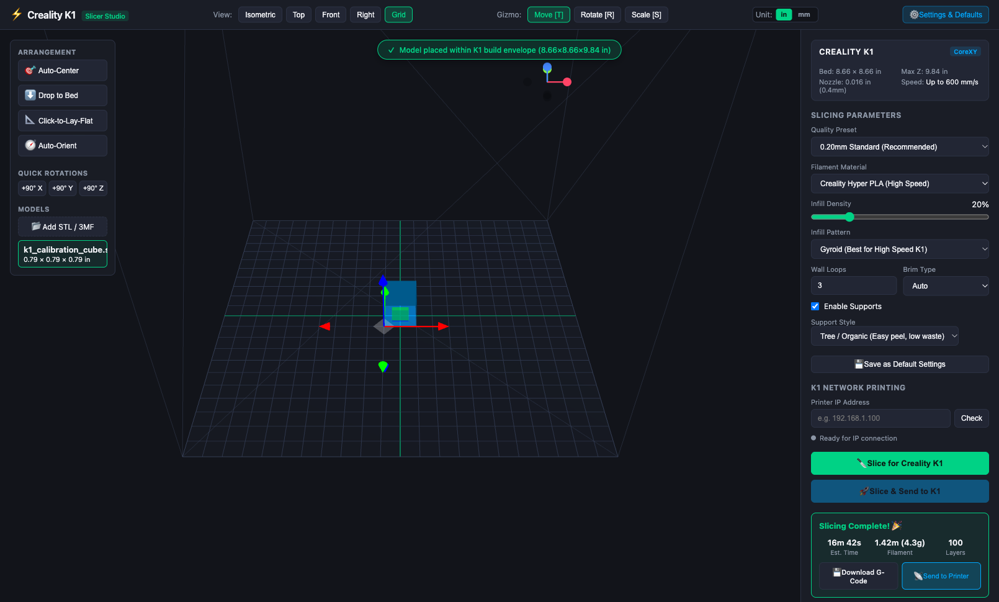

# Creality K1 Slicer Util: Complete Tutorial & Guide 📖

Welcome to the **Creality K1 Slicer Util** tutorial. This guide walks you through everything from instant 1-second headless slicing in your terminal to visual plate arrangement and direct LAN printing to your Creality K1.

---

## Table of Contents
1. [Initial Setup](#initial-setup)
2. [Step 1: Your First Headless Slice (< 1s)](#step-1-your-first-headless-slice--1s)
3. [Step 2: Exploring the 3D Plate Studio](#step-2-exploring-the-3d-plate-studio)
4. [Step 3: Loading Models & Out-of-Bounds Detection](#step-3-loading-models--out-of-bounds-detection)
5. [Step 4: Smart Alignment & "Click-to-Lay-Flat"](#step-4-smart-alignment--click-to-lay-flat)
6. [Step 5: Configuring Global Defaults](#step-5-configuring-global-defaults)
7. [Step 6: Slicing & Direct LAN Printing](#step-6-slicing--direct-lan-printing)
8. [Advanced CLI Recipes & Pro Tips](#advanced-cli-recipes--pro-tips)

---

## Initial Setup

### Quickstart (Automated 1-Click Setup)
Run the bundled setup script to automatically verify Node.js, install OrcaSlicer via Homebrew if needed, install dependencies, compile the project, and link `k1-slice`:

```bash
git clone git@github.com:PopBot/creality-slicer-util.git
cd creality-slicer-util

# Run setup script:
./scripts/setup.sh
# (or: npm run setup)
```

### Manual Setup
```bash
# 1. Install OrcaSlicer (provides Creality K1 slicing profiles)
brew install --cask orcaslicer

# 2. Clone and install project dependencies
git clone git@github.com:PopBot/creality-slicer-util.git
cd creality-slicer-util
npm install
npm run build

# 3. Link globally so 'k1-slice' is available everywhere
npm link

# 4. Run the test suite to verify the pipeline
npm test
```

---

## Step 1: Your First Headless Slice (< 1s)

When you just want a model sliced quickly without opening any heavyweight GUI, pass your STL file directly to `k1-slice` (a calibration cube is bundled in `samples/`):

```bash
k1-slice samples/k1_calibration_cube.stl
```

### What Happens Behind the Scenes:
1. **Geometry Inspection:** The tool parses your mesh, checks its bounding dimensions, and ensures it fits the $8.66 \times 8.66 \times 9.84\text{ in}$ ($220 \times 220 \times 250\text{ mm}$) build envelope.
2. **Auto-Centering & Grounding:** Centers the model at $(110, 110)$ on the plate and sets the lowest vertex to $Z = 0$.
3. **OrcaSlicer Core Invocation:** Applies Creality K1 kinematics, acceleration limits ($20{,}000\text{ mm/s}^2$), and Hyper PLA fan speeds.
4. **Summary Card:** Outputs full print metrics:
   ```text
   ======================================================
     ⚡ CREALITY K1 SLICER ENGINE (OrcaSlicer Core)
     Bed Volume: 8.66 × 8.66 × 9.84 in (220 × 220 × 250 mm)
     Preset    : standard | Default Unit: inches
   ======================================================

   📦 Model Metrics: k1_calibration_cube.stl
      Dimensions : 0.79 × 0.79 × 0.79 in (20.0 × 20.0 × 20.0 mm)
      Position   : X [0.00 to 0.79 in], Y [0.00 to 0.79 in], Z [0.00 to 0.79 in]
      Triangles  : 12
   🎯 Auto-centering model at (110, 110) and grounding to Z=0...
   🔪 Slicing with Creality K1 profiles...

   ✅ SLICING COMPLETE in 0.1s!
   ──────────────────────────────────────────────────────
     ⏱️  Est. Print Time : 16m 42s
     🧵 Filament Used   : 1.42 m (4.3 g)
     🥞 Layer Count     : 100 layers
     📏 Max Z Height    : 20.00 mm
     💾 Output G-Code   : samples/k1_calibration_cube.gcode (0.63 MB)
   ──────────────────────────────────────────────────────
   ```

---

## Step 2: Exploring the 3D Plate Studio

To open the interactive visual plate studio without needing a file upfront, simply run:

```bash
k1-slice
```
*(Or `k1-slice studio`)*.

Your default browser will open to `http://localhost:3125`:


### Key Features of the Studio:
- **📏 Inches as Default Measurement Unit:**
  - Designed for makers who prefer imperial units: the bed size ($8.66 \times 8.66 \times 9.84\text{ in}$), model dimensions, and boundary alerts display in inches by default.
  - **Unit Toggle:** Easily flip between `in` and `mm` using the toggle buttons in the top navigation bar.
- **Full 360° Navigation:** Left-click + drag to orbit in any direction with no axis clamping. Right-click to pan. Scroll to zoom.
- **Creality K1 Build Bed:** Accurately rendered $220 \times 220\text{ mm}$ textured build plate with $10\text{ mm}$ grid lines, center crosshair, and $250\text{ mm}$ height bounding cage.
- **Camera Snapping:** Instant isometric, top-down, front, and side angle buttons in the top bar.

---

## Step 3: Loading Models & Out-of-Bounds Detection

You can load 3D models onto the build plate in two ways:
1. **Drag-and-Drop:** Drag one or more `.stl` or `.3mf` files straight from Finder into the browser window.
2. **File Picker:** Click **"📂 Add STL / 3MF"** in the left palette.


### Real-Time Boundary Safety Checks
The studio continuously monitors geometry in real time:
- **Inside Bounds (Green):** Displays `✓ Model placed within K1 build envelope (8.66×8.66×9.84 in)`.
- **Outside Bounds (Glowing Red):** If a model crosses $X \notin [0, 8.66\text{ in}]$, $Y \notin [0, 8.66\text{ in}]$, sinks below the bed ($Z < 0$), floats unsupported ($Z > 0$), or exceeds max height, the mesh turns glowing red and specific warning badges appear.

---

## Step 4: Smart Alignment & "Click-to-Lay-Flat"

When orienting models on the plate, use the dedicated tools in the left toolbar:

### 1. "Click-to-Lay-Flat" (Face Snapping)
1. Click the **"📐 Click-to-Lay-Flat"** button in the left toolbar.
2. Click any flat surface or triangle facet on your 3D mesh.
3. The engine calculates the world-space normal of that face, rotates the entire model so that face rests flat against the plate, and snaps $Z = 0$.

### 2. Auto-Orient (Heuristic Alignment)
Click **"🧭 Auto-Orient"** to let the algorithmic optimizer score all coplanar surface areas and automatically rotate the model to maximize bed adhesion and minimize support volume.

### 3. Quick +90° Rotations
Use the `+90° X`, `+90° Y`, and `+90° Z` buttons to quickly tumble models into position.

### 4. Interactive 3D Gizmos
Toggle between modes using keyboard shortcuts:
- **`T` (Translate):** Drag arrows to move along X, Y, or Z.
- **`R` (Rotate):** Drag circular rings to rotate around any axis.
- **`S` (Scale):** Scale parts uniformly or along specific axes.

---

## Step 5: Configuring Global Defaults

You can configure and persist your default preferences so you never have to re-enter your printer IP or favorite filament settings again.

### Option A: Via the In-Browser Settings Modal
1. Click **`⚙️ Settings & Defaults`** in the top navigation bar:


2. **Printer & Network Tab:**
   - Enter your Creality K1's IP address (e.g. `192.168.1.150`).
   - Click **"Test Connection"** to verify Moonraker (port `7125`) or Creality OS (port `80`).
3. **Slicing Defaults Tab:**
   - Configure default Quality Preset (Standard 0.20mm, Fine 0.12mm, etc.).
   - Configure default Filament (Hyper PLA, Generic PLA, PETG, ABS, TPU).
   - Set default Infill percentage, Infill pattern (Gyroid recommended for K1), Wall loops, and Support style (Tree vs Normal).



4. **Bed & Placement Tab:**
   - Set Default Measurement Unit (`inches` vs `mm`).
   - Toggle Auto-centering and Auto-orient defaults.
5. Click **"Save Defaults"** — settings are permanently saved to `~/.k1-slicer/config.json`.

### Option B: Via the Terminal
```bash
# View all current defaults
k1-slice config

# Set default unit of measurement (inches or mm):
k1-slice config set unit inches

# Set default printer IP:
k1-slice config set printer-ip 192.168.1.150

# Set default filament:
k1-slice config set material hyper-pla

# Set default infill and pattern:
k1-slice config set infill 20
k1-slice config set infill-pattern gyroid

# Reset to factory defaults at any time:
k1-slice config reset
```

---

## Step 6: Slicing & Direct LAN Printing

Once your model is positioned and settings are tuned:

1. Click **"🔪 Slice for Creality K1"**.
2. OrcaSlicer slices the geometry in seconds and displays the completed results card:



### Available Actions:
- **💾 Download G-Code:** Downloads the generated `.gcode` file with embedded K1 touch-screen thumbnails.
- **📡 Send to Printer:** Uploads the file over your local WiFi/LAN to your K1 printer via Moonraker (port `7125`) or stock Creality OS (port `80`).

---

## Advanced CLI Recipes & Pro Tips

### 1. High-Detail Miniature (0.12mm, Tree Supports)
```bash
k1-slice figurine.stl -p fine --infill 25 --supports --support-type tree
```

### 2. High-Strength Functional Part (4 Walls, Gyroid Infill, PETG)
```bash
k1-slice bracket.stl -m petg --walls 4 --infill 30 --infill-pattern gyroid --brim outer
```

### 3. Rapid Draft Prototype (0.24mm, Hyper PLA)
```bash
k1-slice prototype.stl -p draft -m hyper-pla --infill 10
```

### 4. One-Liner Slice, Upload & Print
```bash
# Slice and immediately start printing on your K1:
k1-slice bracket.stl --printer-ip 192.168.1.150 --print
```

---

## Summary of Shortcuts

| Action | Shortcut / Control |
| :--- | :--- |
| **Orbit Camera** | Left Mouse Drag (360° unconstrained) |
| **Pan Camera** | Right Mouse Drag |
| **Zoom** | Mouse Scroll Wheel |
| **Move Gizmo** | Press `T` |
| **Rotate Gizmo** | Press `R` |
| **Scale Gizmo** | Press `S` |
| **Snap Face Flat** | Click "Click-to-Lay-Flat", then click mesh face |
| **Load Files** | Drag & drop `.stl` / `.3mf` into browser window |
